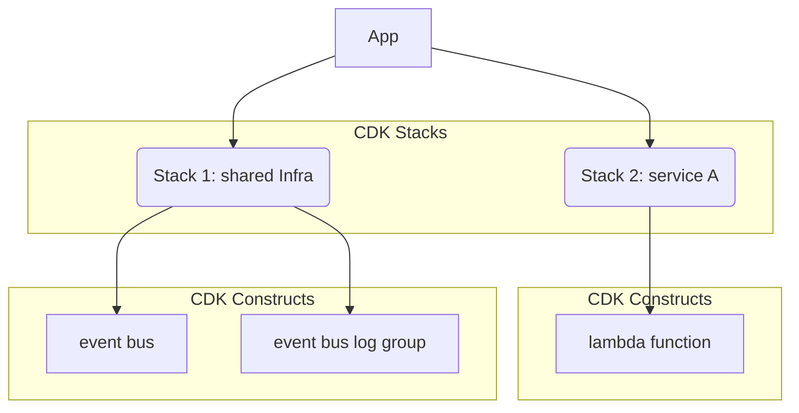

# serverless-with-cdk

create and deploy a simple serverless application within 10 mins

## Prerequisites

Before running the local invocation script, ensure you have AWS SAM installed on your machine. You can install it by following the instructions in the [AWS SAM documentation](https://docs.aws.amazon.com/serverless-application-model/latest/developerguide/serverless-sam-cli-install.html).

### Installation Instructions

- **For macOS**: You can install AWS SAM CLI using Homebrew:
  ```bash
  brew tap aws/tap
  brew install aws-sam-cli
  ```

- **For Windows**: You can install AWS SAM CLI using the MSI installer available on the [AWS SAM CLI installation page](https://docs.aws.amazon.com/serverless-application-model/latest/developerguide/serverless-sam-cli-install-windows.html).

- **For Linux**: You can install AWS SAM CLI using the following commands:
  ```bash
  curl -Lo sam-installation-script.sh https://raw.githubusercontent.com/aws/aws-sam-cli/develop/scripts/install.sh
  chmod +x sam-installation-script.sh
  ./sam-installation-script.sh
  ```

Make sure to follow the instructions specific to your operating system to ensure a successful installation.

## Infrastructure Tree

we organize infra into a tree - [the construct tree](https://docs.aws.amazon.com/cdk/v2/guide/constructs.html#constructs_tree), which will make our infra resources "loosely coupled" between services and make them easy to maintain and read.

**Composition** is the killer feature of IAC
  
- reusable components can **implement best practices** and share it within an organisation/team/company, or publicly
- higher-level abstractions are composed from many lower-level constructs, and those lower-level constructs can be composed from even lower-level constructs #iac-composition  

### 3 Layers of the tree

- [**App**](https://docs.aws.amazon.com/cdk/v2/guide/apps.html) is the root of the tree, a top layer construct which represents the entire application.
- the **APP** is a container of one or more [**Stacks**](https://docs.aws.amazon.com/cdk/v2/guide/stacks.html). Each stack represents a deployable [Cloudformation Stack](https://docs.aws.amazon.com/AWSCloudFormation/latest/UserGuide/stacks.html) template. A stack defines a collection of AWS resources that you can manage as a single unit:(create, update, delete)
- [**Constructs L0-3**](https://docs.aws.amazon.com/cdk/v2/guide/constructs.html) are the basic building blocks of AWS CDK apps. Most often used constructs are Level2 and Level3
  - [L2 construct](https://docs.aws.amazon.com/cdk/v2/guide/constructs.html#constructs_using)
  - L3 constructs built with L0-L2, [examples](https://cdkpatterns.com/patterns/)



> **note**:
>
> - this diagram is rendered with [Mermaid](https://mermaid.js.org/), to learn more, visit github blog: [Include diagrams in your Markdown files with Mermaid](https://github.blog/2022-02-14-include-diagrams-markdown-files-mermaid/)

## Development and Deploy

1. if you run CDK deploy locally, modify the `.env.local` to set the target account and region explicitly

2. run `cdk diff` before you deploy to AWS
   this cmd will output the difference between the already deployed CloudFormation template and the CloudFormation template equivalent of our current CDK code.
3. if you are happy the result from `cdk diff`,
   run `cdk deploy` to deploy the resources

Since this app includes more than a single stack, specify which stacks to use (wildcards are supported) or specify `--all`

## Local Invocation of Lambda Functions

Ensure you have a default `testEvent.json` in `src/scripts/`. This file should contain a sample event that your Lambda function expects.

### Creating the Default Test Event

1. Navigate to the `src/scripts/` directory.
2. Create a file named `testEvent.json`.
3. Populate it with a sample event structure. For example:
